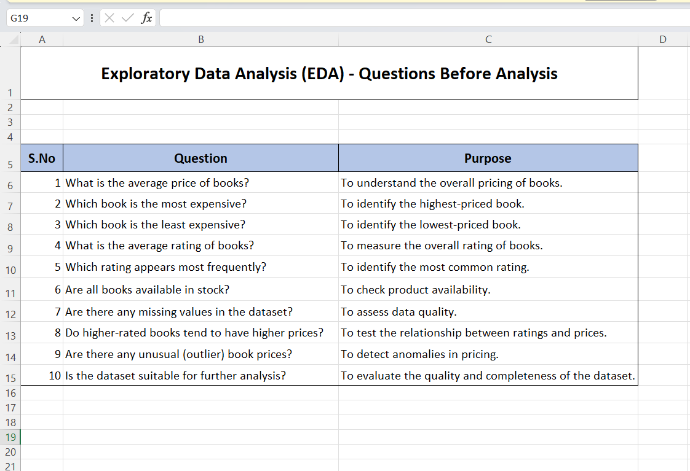
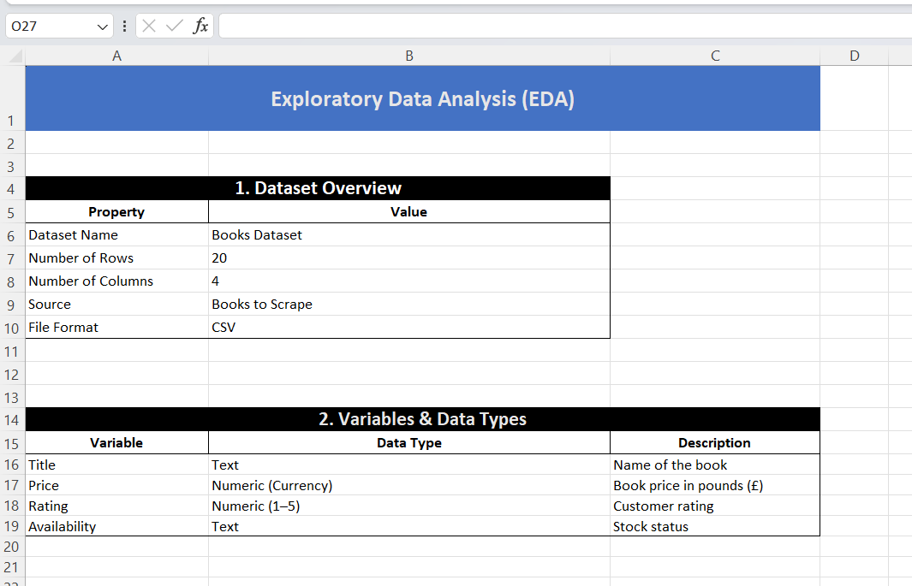
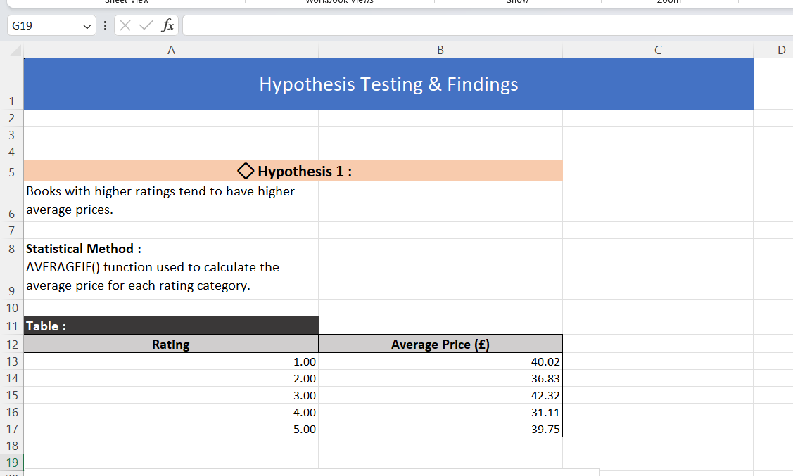

# 📊 CodeAlpha Data Analytics Internship – Task 2
## Exploratory Data Analysis (EDA) on Books Dataset

This repository contains **Task 2** of my **CodeAlpha Data Analytics Internship**.

The objective of this project is to perform **Exploratory Data Analysis (EDA)** on a books dataset collected from the **Books to Scrape** website and extract meaningful insights using Microsoft Excel.

---

## 📌 Project Objectives

- Ask meaningful questions before starting the analysis.
- Explore the dataset structure.
- Identify variables and data types.
- Perform summary statistical analysis.
- Identify trends, patterns, and anomalies.
- Test hypotheses using statistical methods.
- Validate assumptions using charts and visualizations.
- Detect potential data quality issues.

---

## 📂 Dataset Information

- **Dataset Name:** Books Dataset
- **Source:** Books to Scrape
- **Rows:** 20
- **Columns:** 4

### Variables

- Title
- Price (£)
- Rating (1–5)
- Availability

---

## 📊 Analysis Performed

### Dataset Exploration

- Dataset overview
- Variables and data types
- Data structure analysis

### Summary Statistics

- Average Price
- Highest Price
- Lowest Price
- Average Rating
- Most Frequent Rating
- Books Available in Stock
- Missing Value Check

### Questions Before Analysis

The project begins with 10 meaningful business questions, including:

- What is the average price of books?
- Which book is the most expensive?
- Which rating appears most frequently?
- Are all books available in stock?
- Do higher-rated books have higher prices?
- Are there any unusual book prices?
- Is the dataset suitable for further analysis?

---

## 📈 Hypothesis Testing

### Hypothesis 1

**Books with higher ratings tend to have higher average prices.**

**Statistical Method Used**

- AVERAGEIF()

**Result**

The analysis shows that higher-rated books do not consistently have higher prices.

**Conclusion**

Hypothesis 1 is **not supported** by this dataset.

---

### Hypothesis 2

**All books are available in stock.**

**Statistical Method Used**

- COUNTIF()

**Result**

All 20 books are available in stock.

**Conclusion**

Hypothesis 2 is **supported**.

---

## 📉 Visualizations

The project includes:

- Book Rating Distribution Chart
- Average Price by Rating Chart

These visualizations help validate the statistical findings and better understand the dataset.

---

## ⚠ Potential Data Issues

- No missing values found.
- No duplicate records detected.
- Small dataset size (20 books).
- Data collected from a single website.
- Dataset may change over time as the website updates.

---

## 📌 Key Findings

- Average Book Price: **£38.05**
- Highest Price: **£57.25**
- Lowest Price: **£13.99**
- Average Rating: **2.85 Stars**
- Most Frequent Rating: **1 Star**
- All books are currently in stock.
- No consistent relationship exists between ratings and prices.

---

## 🛠 Tools Used

- Microsoft Excel
- Excel Functions
  - AVERAGE
  - MAX
  - MIN
  - MODE
  - COUNTIF
  - AVERAGEIF
- Charts
  - Column Chart
  - Bar Chart

---

## 📁 Repository Contents

- EDA_Books.xlsx
- README.md
- Screenshots of Visualizations

---

## 📚 Internship

**CodeAlpha Data Analytics Internship**

Task 2 – Exploratory Data Analysis (EDA)

---

## 📸 Project Screenshots

### Questions Before Analysis

---

### Exploratory Data Analysis

---

### Hypothesis Testing & Findings

## 👨‍💻 Author

**Amit Pandey**

CodeAlpha Data Analytics Intern

GitHub: https://github.com/amit-pandey920

---

⭐ Thank you for visiting this repository.
